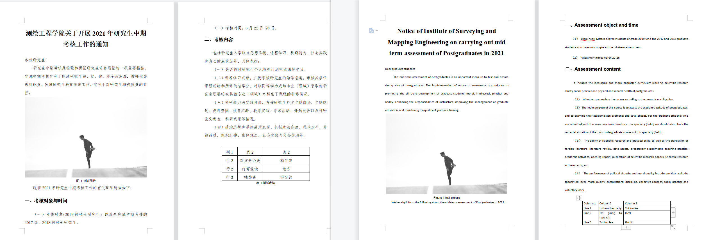

# 文档级中翻英小工具
## 主要功能
- 可翻译任意长度的 doc/docx 文档（不过受百度翻译API调用频率的限制，长文档翻译一般需要较长时间，特别是表格较多的文档）
- 不局限于中文翻英文（可在 `cofig.yaml` 配置文件中指定源语言和目标语言）
- **翻译结果能够保留源文档的段落样式**

## 效果图

左为源文档，右为中翻英结果文档



## 使用方法
### 准备

#### Python 环境

需要先安装 Python（建议通过 [Anaconda](https://www.anaconda.com/) 安装），以及 `requirements.txt` 中指定的包，版本不一定需要完全对应。

通过 `requirements.txt` 安装包有快捷方法（前提是电脑上安装了 Anaconda），先使用命令行切换到该项目的根目录下，再执行如下命令即可：

```shell
pip freeze > requirements.txt
```

#### 百度翻译 API

前往[百度翻译 API 官网](https://fanyi-api.baidu.com/product/113)申请自己的 appid，申请方式该网站已介绍地很清楚，这里不再赘述。

### 开始使用

#### 参数设置

参数都在 `config.yaml` 文件中设置，包含：

- appid：即你在百度翻译 API 官网申请的 appid
- appkey：与上述 appid 配套的 appkey
- file_path：待翻译文档路径
- save_path：翻译结果保存路径
- src_language：待翻译文档所属语言，默认为 ‘zh’，所有可选的语言可到 [百度翻译 API 官网](https://fanyi-api.baidu.com/product/113) 查看
- tar_language：目标语言，默认为 ‘en’，同上

#### 运行

将命令行切换到在项目根目录，并执行如下命令

```shell
python translate_zh2eng_document.py
```

## 额外说明

若在使用过程中遇到问题可提 issue，或直接通过邮件: 201910852081 at ecut dot edu dot cn(将 'at' 替换成 '@'，'dot' 替换成 '.') 联系我。

